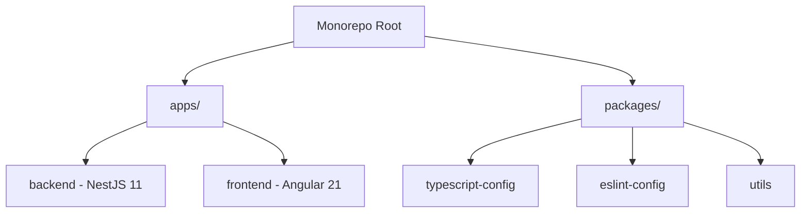
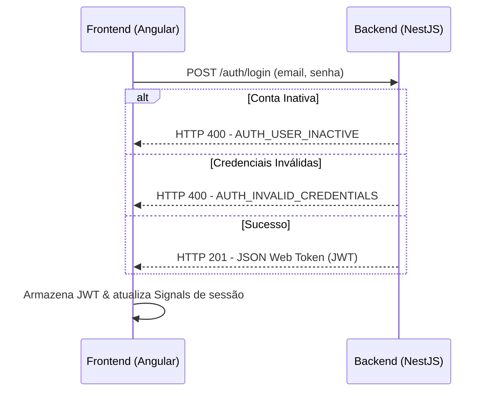

# Especificação Arquitetural do Projeto (specs/arquitetura.md)

Este documento centraliza as diretrizes, padrões e decisões de arquitetura de software adotadas no monorepo para garantir a consistência técnica, facilidade de manutenção e escalabilidade do projeto de ponta a ponta.

---

## 🏗️ 1. Visão Geral e Estrutura do Monorepo

O projeto está estruturado em um **monorepo** gerenciado pelo **Turborepo** e **pnpm workspaces**.



### Tecnologias Principais
* **Gerenciador de Pacotes**: `pnpm` (versão 9.0.0+)
* **Orquestrador de Tarefas**: `turbo` (orquestra builds, lints e testes de forma otimizada)
* **Backend**: NestJS 11, TypeScript 5.x, SQLite com TypeORM
* **Frontend**: Angular 21+, TailwindCSS v4, RxJS 7.x, Vitest

---

## 🔒 2. Fluxo de Autenticação e Segurança

A segurança é implementada de forma integrada entre o backend e o frontend através de tokens JWT de sessão curta (expiração de 60 minutos).



### Backend Guards (NestJS)
* **`JwtAuthGuard`**: Responsável por extrair o token do cabeçalho `Authorization: Bearer <token>`, validá-lo e anexar o perfil decodificado ao objeto `req.user`.
* **`RolesGuard`**: Utiliza o decorator `@Roles('admin')` para interceptar a requisição e validar se a role do usuário no token possui o perfil de administrador antes de dar acesso às rotas restritas.

### Frontend Guards (Angular)
* **`authGuard`**: Impede a navegação de usuários não autenticados para rotas privadas, redirecionando-os para `/access-denied` ou `/login`.
* **`adminGuard`**: Bloqueia o acesso a caminhos como `/admin` caso a role do usuário logado não seja explicitamente `admin`.

### Seed de Dados Iniciais (Admin)
O sistema possui um `SeedService` (`apps/backend/src/users/seed.ts`) que é executado automaticamente na inicialização da aplicação via o lifecycle hook `OnModuleInit` do NestJS. Ele cria de forma **idempotente** o primeiro usuário administrador:
* **E-mail**: `admin@ueg.br`
* **Senha padrão**: `admin123`
* **Role**: `ADMIN` | **Ativo**: `true`

> [!IMPORTANT]
> A senha padrão do admin deve ser alterada imediatamente após o primeiro deploy em qualquer ambiente.

O `SeedService` está registrado como provider no `UsersModule` e utiliza o método `UsersService.createAdmin()`, que retorna o usuário existente caso já tenha sido criado anteriormente (sem duplicar).

---

## 📊 3. Gerenciamento de Estado Reativo (Frontend)

O frontend adota **Angular Signals** como mecanismo primário de reatividade e controle de estado.

```
                  ┌──────────────────────────────┐
                  │      AuthService (Signals)   │
                  │  - currentUser = signal(...) │
                  │  - isAuth = signal(bool)     │
                  │  - isAdmin = signal(bool)    │
                  └──────────────┬───────────────┘
                                 │
                     Modifica / Atualiza
                                 │
                  ┌──────────────▼──────────────┐
                  │    UsersListComponent       │
                  │  - searchQuery = signal()   │
                  │  - filteredUsers = computed │
                  └──────────────┬──────────────┘
                                 │
                          Bind Reativo
                                 │
                  ┌──────────────▼──────────────┐
                  │      Template (HTML)        │
                  │  [ngModel]="searchQuery()"   │
                  └─────────────────────────────┘
```

* **Computed Signals**: Usados para derivar estados síncronos e puros a partir de outros Signals. Por exemplo, o filtro de busca de usuários no painel de administração é derivado dinamicamente:
  ```typescript
  filteredUsers = computed(() => {
    const list = this.usersList();
    const query = this.searchQuery().trim().toLowerCase();
    if (!query) return list;
    return list.filter(u => u.nome.toLowerCase().includes(query));
  });
  ```

---

## 🛜 4. Comunicação, DTOs e Tratamento de Erros

### DTOs de Validação (Backend)
Todos os payloads de entrada dos controllers NestJS devem ser rigidamente validados no nível do DTO usando `class-validator` e `class-transformer`:
```typescript
import { IsEmail, IsNotEmpty, MinLength, IsString } from 'class-validator';

export class CreateUserDto {
  @IsEmail()
  @IsNotEmpty()
  email!: string;

  @IsString()
  @IsNotEmpty()
  nome!: string;

  @MinLength(6)
  password!: string;
}
```

### Tratamento e Tradução de Erros
* O backend lança exceções de regras de negócio estendendo `BusinessException` que geram payloads de erro estruturados e previsíveis.
* O frontend implementa uma função utilitária global `parseAuthError` em `apps/frontend/src/app/core/utils/error-handler.util.ts`. Essa função converte códigos pré-definidos (como `AUTH_EMAIL_EXISTS` ou `AUTH_USER_INACTIVE`) em mensagens traduzidas legíveis por humanos:
  ```typescript
  export function parseAuthError(error: any): string {
    const code = error?.error?.error;
    if (code === 'AUTH_EMAIL_EXISTS') return 'Este e-mail já está em uso.';
    if (code === 'AUTH_USER_INACTIVE') return 'Esta conta está pendente de aprovação pelo administrador.';
    return error?.error?.message || 'Ocorreu um erro inesperado.';
  }
  ```

---

## 🎯 5. Políticas de Qualidade e Governança de Código

Para garantir a sustentabilidade do projeto no longo prazo, todos os agentes de IA e desenvolvedores humanos devem obedecer às seguintes regras de qualidade:

### 🚫 Proibição Estrita do Tipo `any` (TypeScript)
O uso do tipo genérico `any` em TypeScript é **estritamente proibido** no frontend e no backend. Toda e qualquer variável, parâmetro, retorno de função e propriedade deve ser tipada de forma forte e precisa.
* **Exceção única**: O tipo `any` só poderá ser utilizado caso haja uma orientação ou restrição técnica explícita na especificação do usuário.
* **Exemplo de correção**: Em controllers onde o Express Request é injetado, deve-se utilizar a tipagem de requisição do Express ou uma interface especializada em vez de `any`:
  ```typescript
  import { Request as ExpressRequest } from 'express';
  // CORRETO:
  async login(@Request() req: ExpressRequest)
  ```

### 🧪 100% de Cobertura em Testes (TDD Mandatório)
* **Backend**: Utiliza **Jest**. Todos os módulos de lógica de negócio (`UsersService`, `AuthService`, utilitários) devem ter arquivos `.spec.ts` com cobertura completa de casos de erro e sucesso.
* **Frontend**: Utiliza **Vitest** e `@angular/core/testing` (TestBed). Componentes baseados em Signals, guards de roteamento e serviços HTTP devem possuir testes spec mockados completos para garantir que modificações futuras não quebrem funcionalidades existentes.
